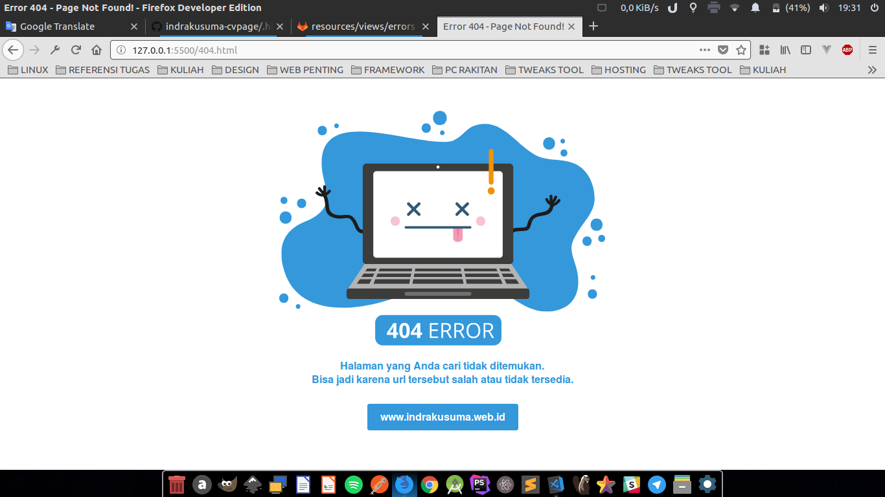

# Simple 404 Template

If you want to get simple template of 404 error page, You can use this template. This template was inspired from detik.com error page.

## Simple.Lightweight.Responsive



## How to Install ?

### Apache Server (Not using Framework)
- clone this template
- add `.htaccess`
- add this code
```
ErrorDocument 404 404.html
```
- Done

### Install on Laravel
- clone this repo
- copy `assets` to your `public` folder.
- make folder `errors` at `/resources/views/`
- copy `404.html` to `/resources/views/errors/` and rename to `404.blade.php`
- done
